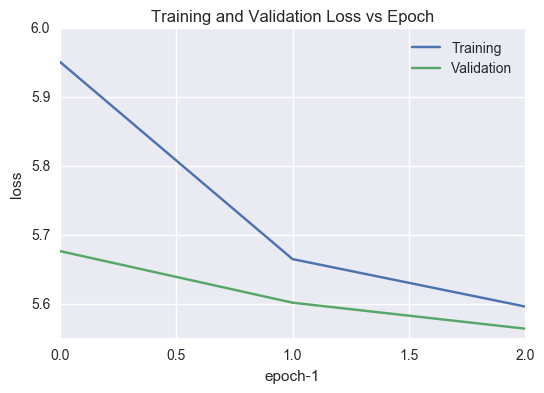

<!-- fontfamily: font package to use for LaTeX documents (with pdflatex): TeXLive has bookman (Bookman), utopia or fourier (Utopia), fouriernc (New Century Schoolbook), times or txfonts (Times), mathpazo or pxfonts or mathpple (Palatino), libertine (Linux Libertine), arev (Arev Sans), and the default lmodern, among others. -->

# Word Prediction using Recurrent Neural Networks

Brian Burns  
Udacity Machine Learning Engineer Nanodegree  
January 31, 2017  

<!-- from https://review.udacity.com/#!/rubrics/108/view -->

## Definition

### Project Overview

<!-- Student provides a high-level overview of the project in layman's terms.
Background information such as the problem domain, the project origin, and
related data sets or input data is given. -->

Word prediction, or *language modeling*, is the task of predicting the most
likely words following the preceding text. It has many applications, such as
suggesting the next word as text is entered, as an aid in resolving ambiguity in
speech and handwriting recognition, and in machine translation.

The generation of a likely word given prior words goes back to Claude Shannon's
work on information theory (Shannon 1948) based in part on Markov models
introduced by Andrei Markov (Markov 1913) - counts of encountered word sequences
are used to estimate the conditional probability of seeing a word given the
prior words. These so called n-grams formed the basis of commercial word
prediction software in the 1980's, eventually supplemented with similar syntax
and part of speech predictions (Carlberger 1997).

More recently, distributed representations of words have been used (so called
*word embeddings*), in which each word is represented by a vector in some
low-dimensional vector space (e.g. as a vector of 100 floating point numbers) -
these can better handle data sparsity and allow more of the context to affect
the prediction, as they can represent similar words as being close together in
vector space. Hence, for instance, a cat can be predicted to 'sleep', even if
the model was only trained on a dog sleeping, due to the similarity of the words
'dog' and 'cat'.

Feed-forward networks (FNNs) with a fixed amount of context were initially used
(Bengio 2003), then Recurrent Neural Networks (RNNs) as training them became
more feasible (Mikolov 2012). An RNN can make predictions based on arbitrary
amounts of context because it effectively stores the history of everything it has
seen in a hidden layer.

The neural network learns word vectors as it is trained, though pre-trained word
embeddings are available, such as word2vec (Mikolov 2013) and GloVe (Pennington
2014) - these can be used in place of the input layer to save on training time.
They have only become available recently due to the computational complexity of
calculating them for large vocabularies (e.g. 400,000 words for GloVe).

The rest of the neural network learns the language model - it effectively learns
a function that maps a sequence of input word vectors to the probability of
the next word in the sequence, over the whole vocabulary.

The problem is a supervised learning task, and any text can be used to train and
evaluate the models - we'll be using a million words from books digitized by the
Gutenberg Project (Gutenberg 2016) for evaluation. Others use larger corpora,
e.g. Google's billion word corpus (Chelba 2013). Depending on the problem
domain, different corpora might be more appropriate, e.g. training on a
chat/texting corpus would be more applicable for a phone text entry application.

<!-- "Language modeling---or more specifically, history-based language modeling (as -->
<!-- opposed to full sentence models)---is the task of predicting the next word in a -->
<!-- text given the previous words." -->
<!-- "Language modeling is the art of determining the probability of a sequence of words." -->

<!-- "The main advantage of NNLMs over n-grams is that history is no longer seen as -->
<!-- exact sequence of n - 1 words H, but rather as a projection of H into some lower -->
<!-- dimensional space. This reduces number of parameters in the model that have to -->
<!-- be trained, resulting in automatic clustering of similar histories." mikolov 2012 thesis -->
<!-- The hidden layer of RNN represents all previous -->
<!-- history and not just n -1 previous words, thus the model can theoretically represent long -->
<!-- context patterns -->
<!-- however the error gradients quickly vanish as they get backpropagated in time -->
<!-- (in rare cases the errors can explode), so several steps of unfolding are -->
<!-- sufficient (this is sometimes referred to as truncated BPTT). -->
<!-- **While for word -->
<!-- based LMs, it seems to be sufficient to unfold network for about 5 time steps, -->
<!-- it is interesting to notice that this still allows the network to learn to store -->
<!-- information for more than 5 time steps. -->
<!-- Similarly, network that is trained by normal backpropagation can be seen as a -->
<!-- network trained with one unfolding step, and still as we will see later, even -->
<!-- this allows the network to learn longer context patterns, such as 4-gram -->
<!-- information. -->
<!-- A simple solution to the exploding gradient problem is to truncate values of the -->
<!-- gradients. In my experiments, I did limit maximum size of gradients of errors -->
<!-- that get accumulated in the hidden neurons to be in a range < -15; 15 >. This -->
<!-- greatly increases stability of the training, and otherwise it would not be -->
<!-- possible to train RNN LMs successfully on large data sets. -->
<!-- (Mikolov 2012) -->

### Problem Statement

<!-- The problem which needs to be solved is clearly defined.
A strategy for solving the problem,
including discussion of the expected solution, has been made. -->

Given a sequence of words, we'll make a prediction for the following *k* most
likely words and their probabilities.

For example, for the sequence "the dog" and *k*=3, a solution might be (barked
10%, slept 9%, ran 8%).

We'll use an RNN to make the predictions - different architectures will be
trained on a training set, tuned on a validation set, and tested on a hold-out
test set - the results will be compared against a baseline n-gram model, with
the best model chosen for more complete analysis - it is anticipated that an
RNN with proper architecture and parameters will be able to beat the n-gram
model.

<!-- A GRU (Gated Recurrent Unit) RNN is expected to offer the best performance for a -->
<!-- given amount of training time, due to its ability to backpropagate the training -->
<!-- information further than a simple RNN, and its relatively low number of -->
<!-- parameters compared to an LSTM (Long Short-Term Memory) RNN. -->

<!-- We'll use some different neural network architectures to find the most likely -->
<!-- next words - a standard Recurrent Neural Network (RNN), a Long Short-Term Memory -->
<!-- (LSTM) RNN, and a GRU (Gated Recurrent Unit) RNN - and compare these against -->
<!-- some baseline n-gram models. The GRU RNN is expected to offer the best -->
<!-- performance for a given amount of training time [cite!]. -->

### Metrics

<!-- Metrics used to measure performance of a model or result are clearly
defined. Metrics are justified based on the characteristics of the problem. -->

The metric used to evaluate the performance of the models will be *accuracy* -
the average number of predictions where the highest probability next word
matches the actual next word:

$$accuracy = \# correct / \# total$$

<!-- The metrics used to evaluate the performance of the models will be -->
<!-- *cross-entropy*, *perplexity*, *accuracy*, and *relevance*. -->

<!-- LOSS=AVG CROSS ENTROPY = 1/N  sum of cross-entropy over training sequence -->

<!-- *Cross-entropy* is a measure of the similarity of two probability -->
<!-- distributions - in this case the actual next word and our predictions for the -->
<!-- next word and their probabilities. A lower value indicates less surprise, and -->
<!-- so, greater fit - -->

<!-- <\!-- ->give intuition also - average of perplexity -\-> -->

<!-- <\!-- $$H(T,q)=-\sum _{{i=1}}^{N}{\frac  {1}{N}}\ln q(x_{i})$$ -\-> -->
<!-- <\!-- with *T*=sequence of training set words, *N*=length of training sequence, -\-> -->
<!-- <\!-- *q*=probability distribution predicted by model, $x_i$ = .  -\-> -->

<!-- this might just be the loss fn -->

<!-- $$H = -\sum _{{i=1}}^{|V|} y_i \ln \hat{y}_i$$ -->

<!-- with *V*=set of vocabulary words, $y_i$=actual next word, one-hot encoded, -->
<!-- $\hat{y}_i$=probability distribution of next word. -->

<!-- *Perplexity* gives an indication of how well the model has narrowed down the -->
<!-- possible choices for the next word - e.g. a perplexity of 300 corresponds -->
<!-- roughly to a uniform choice from 300 words. The average perplexity for a -->
<!-- given sequence can be estimated with -->

<!-- $$perplexity = e^{H(T, q)}$$ -->

<!-- -\-> where *H* is the cross-entropy of a sequence of words *T* and *q* is the -->
<!-- probability of ????. -->

<!-- (Note: some sources use $log_2$ for the cross-entropy, in -->
<!-- which case $2^H$ is used here). -->

<!-- q. pp measures how certain the model is in its predictions, but what if the -->
<!-- predictions are wrong? need p and q in there, right? -->

<!-- *Accuracy* is the average number of predictions where the highest probability -->
<!-- next word matches the actual next word: -->

<!-- $$accuracy = \# correct / \# total$$ -->

<!-- *Relevance* will be defined similarly to accuracy, but allowing any of the top -->
<!-- *k* words to be counted as correct - this is relevant to the task of presenting -->
<!-- a user with a list of most likely next words as they are entering text - we'll -->
<!-- use *k* = 3 for evaluation: -->

<!-- $$relevance = \# correct\, (in\, top\, k\, words) / \# total$$ -->

## Analysis

### Data Exploration

<!-- If a dataset is present, _features_ and _calculated statistics_ relevant to the
problem have been reported and discussed, along with a _sampling_ of the data.
_Abnormalities_ or characteristics about the data or input that need to
be addressed have been identified. -->

The training and testing data are obtained from ten books from Project
Gutenberg, totalling roughly one million words (or 1.3 million tokens, which
include punctuation marks like commas, periods, etc.) -

<!-- note: can make this fixed chars by indenting, but needs to be at left margin to make a latex table -->
<!-- this is output from print(util.table(data.analyze())), then adjusted -->

\small

| Text                                                         |    Words | Letters / Word  | Words / Sentence  |  Unique Words  |   Grade Level |
|--------------------------------------------------------------+----------+-----------------+-------------------+----------------+---------------|
| 1851 Nathaniel Hawthorne The House of the Seven Gables (G77) |   96,217 | 5.2             | 21.2              |        22,214  |            12 |
| 1862 Victor Hugo Les Miserables (G135)                       |  516,244 | 5.2             | 14.6              |        82,177  |            10 |
| 1865 Lewis Carroll Alice in Wonderland (G28885)              |   26,758 | 4.6             | 16.4              |         6,346  |             9 |
| 1883 Robert Louis Stevenson Treasure Island (G120)           |   62,826 | 4.7             | 16.9              |        13,894  |             8 |
| 1898 Henry James The Turn of the Screw (G209)                |   38,663 | 4.9             | 15.4              |         9,417  |             8 |
| 1899 Joseph Conrad Heart of Darkness (G219)                  |   34,833 | 5.0             | 14.5              |         9,871  |             9 |
| 1905 M R James Ghost Stories of an Antiquary (G8486)         |   42,338 | 4.9             | 19.6              |        10,882  |             9 |
| 1907 Arthur Machen The Hill of Dreams (G13969)               |   60,528 | 5.0             | 25.7              |        14,406  |            10 |
| 1908 Kenneth Graham The Wind in the Willows (G289)           |   54,160 | 4.9             | 16.8              |        13,102  |             9 |
| 1919 P G Woodhouse My Man Jeeves (G8164)                     |   46,947 | 4.8             | 10.1              |        10,917  |             8 |
| 1920 M R James A Thin Ghost and Others (G20387)              |   29,311 | 4.7             | 21.3              |         7,767  |             8 |

\normalsize

The grade level is calculated using the Coleman-Liau Index (Coleman 1975), which
is based on the average word and sentence lengths.

The Gutenberg text number is listed in parentheses, and the texts can be found
online - e.g. Alice in Wonderland can be found at
http://www.gutenberg.org/etext/28885.

Some sample text:

> "Speak English!" said the Eaglet. "I don't know the meaning of half those long words, and, what's more, I don't believe you do either!" - *Alice in Wonderland* (shortest words)

> I went up and passed the time of day. "Well, well, well, what?" I said. "Why, Mr. Wooster! How do you do?" - *My Man Jeeves* (shortest sentences)

> From the eminence of the lane, skirting the brow of a hill, he looked down into deep valleys and dingles, and beyond, across the trees, to remoter country, wild bare hills and dark wooded lands meeting the grey still sky. - *The Hill of Dreams* (longest sentences)

### Exploratory Visualization

<!-- A visualization has been provided that summarizes or extracts a relevant
characteristic or feature about the dataset or input data with thorough
discussion. Visual cues are clearly defined. -->

For this project we'll use 50-dimensional word vectors from GloVe (Pennington
2014) - Figure 1 below shows some sample word embeddings projected to 2 dimensions
using PCA - note how the adjectives, verbs, and nouns/agents are grouped
closely together, indicating their similarity.

### Algorithms and Techniques

<!-- Algorithms and techniques used in the project are thoroughly discussed and
properly justified based on the characteristics of the problem. -->

Until recently, n-grams were considered state of the art in word prediction -
neural networks surpassed them in 2003, though at the cost of greater training
time (Bengio 2003).

An RNN is able to remember arbitrary amounts of context, while n-grams are
effectively limited to about 4 words of context (a 5-gram will give 4 words of
context) - higher n-grams require increasing amounts of resources in terms of
training data and storage space, as the resources required grow exponentially
with the amount of context.

An RNN 'unfolds' to a neural network of arbitrary depth for training (called
*Backpropagation Through Time (BPTT)*) - see Figure 2. It keeps track of the
words it has seen through a hidden state at each step in a sequence - this is
combined with the current word's representation (by addition) and the sum is
then used to make predictions about the next word.

<!-- -> is this correct about U? read something different. what about matrix E the -->
<!--    embedding layer? it's separate from U... -->
<!-- and model returns 6 matrices - so... what gives? what is E vs U? -->

The matrix *U* amounts to a table of word embeddings in a vector space of many
dimensions - each word in the vocabulary corresponds with a row in the table,
and the distance between any two words gives their similarity, once the
network is trained. Alternatively, pre-trained word embeddings can be used in an
input layer to save on training time.

The matrix *W* acts as a filter on the internal hidden state, which represents
the prior context of arbitrary length.

The matrix *V* allows each word in the vocabulary to 'vote' on how likely it
thinks it will be next, based on the context (current + previous words). The
softmax output layer then converts these scores into probabilities, so the top
*k* most likely words can be found for a given context.

Multiple layers of RNNs can also be used, in which case there is more than one
hidden state - this allows the network to detect and learn higher level
structures in the input, such as ??????????????????????

To learn the parameters for the matrices *U*, *V*, and *W*, we define an error
(or loss) function to be the *categorical cross-entropy loss*, and use
backpropagation through time to update the weights based on the amount of error
between the outputs and the true values.

<!-- There are two problems with training RNN's - vanishing gradients and exploding -->
<!-- gradients. The gradients tend to either head towards zero or infinity.  -->

A LSTM (Long Short-Term Memory) RNN (Hochreiter 1997) works similarly, but has a
'memory cell' at the center, which has 'switches' for storing memory, or
forgetting memory, and the state of the switches can be learned along with the
rest of the parameters. This turns out to be easier to train than plain RNN's,
which have problems with vanishing and exploding gradients, which make them slow
and difficult to train.

A GRU (Gated Recurrent Unit) RNN (Chung 2014) is similar to an LSTM, but has
fewer parameters and is a bit easier to train. 

<!-- -> show plot here comparing loss curve for rnn vs lstm vs gru -->

<!-- -> do big O analysis here? estimate memory needed, # calcs, time -->

<!-- -> show calcs and matrices for abcd example - nvocab=5, nhidden=2, incl loss vs -->
<!--    accuracy, perplexity -->

<!-- -> then attention 2015? discuss briefly, cite -->

<!-- -> compare word-level with character-level rnn learning - maybe character level -->
<!--    easier on the cpu, as nvocab=26 (or 52 with caps). plus invented words. -->

### Benchmark

<!-- Student clearly defines a benchmark result or threshold for comparing
performances of solutions obtained. -->

For the benchmark model a simple trigram model will be used - this is a standard
approach for next word prediction based on Markov models. A multidimensional
array, indexed by vocabulary words, stores counts of occurrences of 3-tuples of
words based on the training data. These are then normalized to get a probability
distribution, which can be used to predict the most likely words following a
sequence.

<!-- -> find published results, history (when were these first developed, called n-grams, get citations) -->

A more state of the art baseline would be a Kneser-Ney 5-gram model (Kneser
1995), which calculates 1- through 5-grams and interpolates between them, but
implementing that algorithm is beyond the scope of this project.

## Methodology

### Data Preprocessing

<!-- All preprocessing steps have been clearly documented. Abnormalities or
characteristics about the data or input that needed to be addressed have been
corrected. If no data preprocessing is necessary, it has been clearly justified.
-->

The text files contain header and footer information separate from the actual
text, including a Gutenberg license, but these are left in place, and read
together into a single Python UTF-8 string. The string is split into paragraphs,
which are then shuffled randomly - this allows the RNN to learn more context
than if the text was split on sentences and shuffled.

The paragraphs are combined, and the text is converted to lowercase to increase
the amount of vocabulary that can be learned for a given amount of resources.
The text is then tokenized to the top *NVOCAB* words - the rarer words are **not
recorded** - punctuation marks are treated as separate tokens.

The sequence of tokens is then split into training, validation, and test sets -
the validation and test sets were set at 10,000 tokens, and the training set has
nearly 1,300,000 tokens.

### Implementation

<!-- The process for which metrics, algorithms, and techniques were implemented
with the given datasets or input data has been thoroughly documented.
Complications that occurred during the coding process are discussed. -->

The RNN was implemented with Python using Keras (Chollet 2015) with a TensorFlow
backend (Abadi 2015) - TensorFlow is a general-purpose neural network toolbox,
while Keras is a wrapper around TensorFlow that simplifies its use. Different
architectures and parameters were explored, and compared based on their loss and
accuracy scores. The most promising model was then selected for further
analysis.

<!-- -> compare Keras code vs TensorFlow for a simple RNN? -->

The basic architecture of the RNN is an embedding input layer, one or more
hidden layers, a densely connected output layer, and a softmax layer to convert
the outputs to probabilities.

The initial approach used sequences of integer tokens for input and one-hot
encoded tokens for comparison with the output - this proved infeasible
memory-wise - the training data was only $O(nelements * n)$, roughly 1
million * 10 ~ 100MB, but the labels were $O(nelements * nvocab)$, roughly 1
million * 10,000 ~ 1e11 bytes = 100 GB, too much for a 16GB system.

The next approach used Python generators for the input sequences and output
labels - the neural network is able to accept generators instead of arrays
through Keras' `fit_generator` method, but in tests with small datasets this
proved to be about 10x slower than using the one-hot arrays.

The final approach changed the output loss function from
*categorical_crossentropy* to *sparse_categorical_crossentropy* - this allowed
the output labels to be specified as arrays of integer tokens, instead of
one-hot encoded tokens, which allowed them to fit easily into memory, with
$O(nelements)$ ~ 10MB. 

---

During preprocessing the texts were tokenized to the top *nvocab*=10,000 words,
then a word embedding matrix *E* was built from the complete GloVe word
embedding array of 400,000 words, and set as the weights for the neural
network's embedding layer.

For the training step, the training sequence of roughly 1.3 million tokens was fed
to the network, which was trained for a certain number of epochs - depending on
the network configuration each epoch took around 30 minutes.

During training Keras output the progress is displayed and a generated sequence
is displayed before/after each epoch - both the training and validation loss and
accuracy are shown during training and at the end of the epoch, e.g. -

\small

~~~
Training model...
Train on 1283291 samples, validate on 12963 samples
Epoch 0 generated text: of lightly malvern gurgling anybody despairing pointing fray 'm amid antechamber 'm fight sooth paid counter chimney-corner weather chimney-corner pierced
Epoch 1/10
1283291/1283291 [==============================] - 1207s - loss: 5.4187 - acc: 0.1518 - val_loss: 5.1304 - val_acc: 0.1665
Epoch 1 generated text: . `` you will have a , and i have not a man . '' she had a little ,
Epoch 2/10
1283291/1283291 [==============================] - 1207s - loss: 5.1610 - acc: 0.1669 - val_loss: 5.0386 - val_acc: 0.1734
Epoch 2 generated text: ; and it is a man , i have not done to say to the . it was a of
Epoch 3/10
1283291/1283291 [==============================] - 1206s - loss: 5.1034 - acc: 0.1708 - val_loss: 5.0139 - val_acc: 0.1780
Epoch 3 generated text: . he knew that she had no one of the of , of which the first man was , ''
~~~

\normalsize

Overfitting is prevented by an early stopping trigger, which will stop training
if the validation accuracy does not improve for a certain number of epochs.

For evaluation, plots are made of the loss and accuracy over the training
epochs - see Figure 3 below - this also helps diagnose overfitting, which is
indicated by the loss flattening out and starting to increase.

<!-- The *perplexity* of the model is calculated from the *cross-entropy* by taking -->
<!-- the exponential - e.g. math.exp(5.5962) = 269.4. -->

<!-- Similar experiments were performed with the n-gram baseline.  -->

### Refinement

<!-- The process of improving upon the algorithms and techniques used is clearly
documented. Both the initial and final solutions are reported, along with
intermediate solutions, if necessary. -->

The RNN architecture has several parameters which can affect the speed of
training and the accuracy of the model - the total parameter space has nearly
90,000 combinations -

\small

| Parameter     | Description                                   | Values             | Number of values to explore |
|---------------+-----------------------------------------------+--------------------+-----------------------------|
| nepochs       | number of epochs to train model               | 1-10+              |                           1 |
| patience      | stop after this many epochs of no improvement | 1-10               |                           1 |
| layers        | number of RNN layers                          | 1-3                |                           3 |
| dropout       | amount of dropout to apply after each layer   | 0.0-1.0            |                           5 |
| nvocab        | number of vocabulary words to use             | 5k-40k             |                           4 |
| embedding_dim | dimension of word embedding layer             | 50,100,200,300     |                           4 |
| trainable     | train the word embedding matrix?              | True/False         |                           2 |
| nhidden       | size of the hidden layer(s)                   | 50,100,200,300     |                           4 |
| n             | amount to unfold recurrent network            | 1-10               |                           5 |
| rnn_class     | type of RNN to use                            | Simple, LSTM, GRU  |                           3 |
| optimizer     | optimizing algorithm to use                   | sgd, rmsprop, adam |                           3 |
|---------------+-----------------------------------------------+--------------------+-----------------------------|
| total         |                                               |                    |                       86400 |

\normalsize

With each model taking a few hours to train, we'll only be able to explore a
small subset of the parameter space.

If the neural network is too complex or the amount of training data too small,
the model will be prone to overfitting - but if the neural network is too
simple, it may have a high bias error - the best network size for a given amount
of training data will be somewhere in between.

dropout - "Dropout consists in randomly setting a fraction `p` of input units to 0 at each update during training time, which helps prevent overfitting."
"Since a fully connected layer occupies most of the parameters, it is prone to overfitting. The dropout method is introduced to prevent overfitting. "
see [Dropout: A Simple Way to Prevent Neural Networks from Overfitting](http://www.cs.toronto.edu/~rsalakhu/papers/srivastava14a.pdf)
(Srivatsava 2014)

show overfitting curve - too many epochs and loss starts to increase, so need to
do early stopping - eg stop if loss doesn't decrease for n epochs.
because it's fittting to the test data, but loss is against the validation data. 
so want to stop at the lowest loss point.

**add penalty for 'complexity' (ie overfitting, as with decision trees etc) - complexity ~ more nodes, more layers, and larger weights

could also do crossvalidation to get more accurate scores, but would add more training time

"overfitting is a very common problem when the dataset is too small compared with the number of model parameters that need to be learned."
so need more data, or simpler model

take initial stab at training, get scores
then use grid search with sklearn keras wrapper to find good parameters with alice_ch1.txt
then compare those parameters with original guesses on the whole gutenberg dataset

## Results

### Model Evaluation and Validation

<!-- The final model's qualities - such as parameters - are evaluated in detail.
Some type of analysis is used to validate the robustness of the model's
solution. -->

for rnns show the Loss vs epoch graphs to show increasing accuracy

show overfitting training curves - too much training -> overfitting

robustness - ie how performs in the wild - try on some non-gutenberg text - compare diff models - ngrams, rnns

perplexity

"The lowest perplexity that has been published on the Brown Corpus (1 million
words of American English of varying topics and genres) as of 1992 is indeed
about 247 per word, corresponding to a cross-entropy of log2 247 = 7.95 bits per
word or 1.75 bits per letter using a trigram model. It is often possible to
achieve lower perplexity on more specialized corpora, as they are more
predictable."
uh... what's more uptodate value

### Justification

<!-- The final results are compared to the benchmark result or threshold with
some type of statistical analysis. Justification is made as to whether the final
model and solution is significant enough to have adequately solved the problem.
-->

## Conclusion

### Free-Form Visualization

<!-- A visualization has been provided that emphasizes an important quality
about the project with thorough discussion. Visual cues are clearly defined. -->

-> add beam search

Examples of text generated by the different models:

n-gram (n=2):

- Not a sudden vibration in the gate , but in books .
- Hucheloup . `` and whatever , and the Italian , there was no additional contact information about the discovery
- She opened the brim and terrible quagmire was trying to my fancy it had n't know what may be

n-gram (n=3):

- Joy and pride was shortly to be feared on the ground at the old woman , who saw him no
- Blcher ordered Blow to attack us . Here was another , to such an authority in reference to what Boulatruelle
- Dry happiness resembles the voice of the choir , as strange as anything that was easy to inspire my pupils

n-gram (n=4):

- Terror had seized on the whole day , with intervals of listening ; and the gipsy never grudged it him .
- The glass must be violet for iron jewellery , and black for gold jewellery . 
- Dry happiness resembles dry bread . 

GRU

### Reflection

<!-- Student adequately summarizes the end-to-end problem solution and discusses
one or two particular aspects of the project they found interesting or
difficult. -->

The most difficult part of this problem was getting a good project
infrastructure set up - I initially developed a set of Python modules and
classes to handle the data preprocessing and transformations, tokenization, and
record results of experiments, but the main problem was that each step needed to
be saved to disk so that I could develop the models without having to rerun the
expensive steps. I eventually realized it was overkill to develop a separate
program like that and just went with a simpler Jupyter notebook.

Also, it was difficult to experiment with different model architectures, since
each epoch is so expensive - they took about 30 minutes for the full dataset on
my laptop. When I was initially developing the code I tried running simpler
problems for speed but they would immediately start overfitting, so they weren't
very helpful.

### Improvement

<!-- Discussion is made as to how one aspect of the implementation could be
improved. Potential solutions resulting from these improvements are considered
and compared/contrasted to the current solution. -->

train longer, more vocabulary, more hidden nodes

put on amazone instance

online learning (?) - ie learn new vocab words like phone does

better training/testing - distribute text by paragraphs, not sentences

One thing worth noting is that with current hardware limitations, moving away
from n-grams with smoothing might not be the best approach for an application,
since state-of-the-art RNN models can be so slow to train, and the n-grams do
perform pretty well.

-> but compare performance of RNN vs ngrams once trained, in terms of memory and speed!

## References

(Abadi 2015) Abadi, Martin, et al. "TensorFlow: Large-scale machine learning on heterogeneous systems." Software available from tensorflow.org, 2015.

(Bengio 2003) Bengio, Yoshua, et al. "A neural probabilistic language model." Journal of Machine Learning Research, Feb 2003.

(Bird 2009) Bird, Steven, Edward Loper and Ewan Klein, "Natural Language Processing with Python (NLTK Book)." O'Reilly Media Inc., 2009. http://nltk.org/book

(Carlberger 1997) Carlberger, Alice, et al. "Profet, a new generation of word prediction: An evaluation study." Proceedings, ACL Workshop on Natural Language Processing for Communication Aids, 1997.

(Chelba 2013) Chelba, Ciprian, et al. "One billion word benchmark for measuring progress in statistical language modeling." arXiv preprint arXiv:1312.3005, 2013.

(Chollet 2015) Chollet, Francois, "Keras." https://github.com/fchollet/keras, 2015

(Chung 2014) Chung, Junyoung, et al. "Empirical evaluation of gated recurrent neural networks on sequence modeling." (2014) _______________link

(Coleman 1975) Coleman, Meri; and Liau, T. L., "A computer readability formula designed for machine scoring." Journal of Applied Psychology, Vol. 60, pp. 283 - 284, 1975.

(Gutenberg 2016) Project Gutenberg. (n.d.). Retrieved December 16, 2016, from www.gutenberg.org. 

(Hochreiter 1997) Hochreiter, Sepp, "Long Short-Term Memory." Neural Computation 9(8), 1997. 

(Kneser 1995) Kneser, R. & Ney, H. "Improved backing-off for m-gram language modeling." Proceedings of the IEEE International Conference on Acoustics, Speech and Signal Processing, Detroit, MI, volume 1, pp. 181-184. May 1995.

(LeCun 2015) LeCun, Bengio, Hinton, "Deep learning." Nature 521, 436 - 444 (28 May 2015) doi:10.1038/nature14539

(Markov 1913) Markov, Andrei, "An example of statistical investigation of the text Eugene Onegin concerning the connection of samples in chains." Bulletin of the Imperial Academy of Sciences of St. Petersburg, Vol 7 No 3, 1913. English translation by Nitussov, Alexander et al., Science in Context, Vol 19 No 4, 2006

(Mikolov 2012) Mikolov, Tomas, PhD thesis, "Statistical Language Models Based on Neural Networks." http://www.fit.vutbr.cz/~imikolov/rnnlm/thesis.pdf, 2012

(Mikolov 2013) Mikolov, Tomas; et al. "Efficient Estimation of Word Representations in Vector Space." arXiv:1301.3781, 2013.

(Pennington 2014) Pennington, Jeffrey et al.. "GloVe: Global Vectors for Word Representation." http://nlp.stanford.edu/projects/glove/, 2014

>(Rosenblatt 1957) Rosenblatt, F. "The perceptron, a perceiving and recognizing automaton." Project Para. Cornell Aeronautical Laboratory, 1957.

(Shannon 1948) Shannon, Claude, "A Mathematical Theory of Communication." The Bell System Technical Journal, Vol. 27, July 1948.

(Srivatsava 2014) Srivatsava, Nitish, "Dropout: A Simple Way to Prevent Neural Networks from Overfitting." Journal of Machine Learning Research 15, 2014. 

--------------------------------------------------------------------------------

## Quality

### Presentation

<!-- Project report follows a well-organized structure and would be readily
understood by its intended audience. Each section is written in a clear, concise
and specific manner. Few grammatical and spelling mistakes are present.
All resources used to complete the project are cited and referenced. -->

### Functionality

<!-- Code is formatted neatly with comments that effectively explain complex
implementations.
Output produces similar results and solutions as to those
discussed in the project. -->

